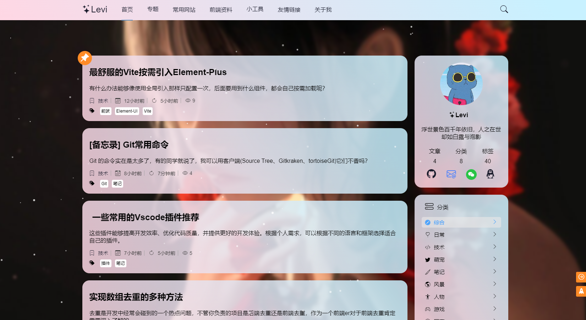
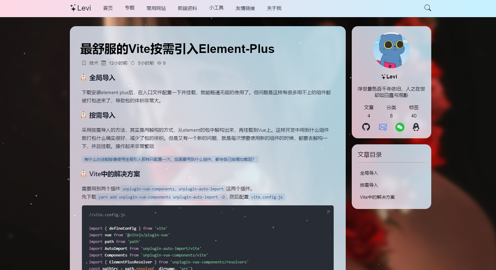

# 个人博客前端项目，使用Vue3+Vite开发
### 具有轻量美观流畅等特点

## 预览地址
[预览博客](https://leviqin.top)

## 预览截图




## 所使用的依赖包介绍
+ md文档解析： @kangc/v-md-editor
+ 代码语法高亮： prismjs
+ 数学公式解析：katex
+ 图表解析： mermaid
+ 瀑布流：wc-waterfall
+ css预处理: sass
+ 触摸手势： hammerjs
+ 日期：dayjs
+ icon: bootstrap-icons
+ 懒加载：vue-lazyload

### 安装依赖
```
yarn
```

### 开发运行
```
yarn run dev
```

### 打包生产
```
yarn run build
```
